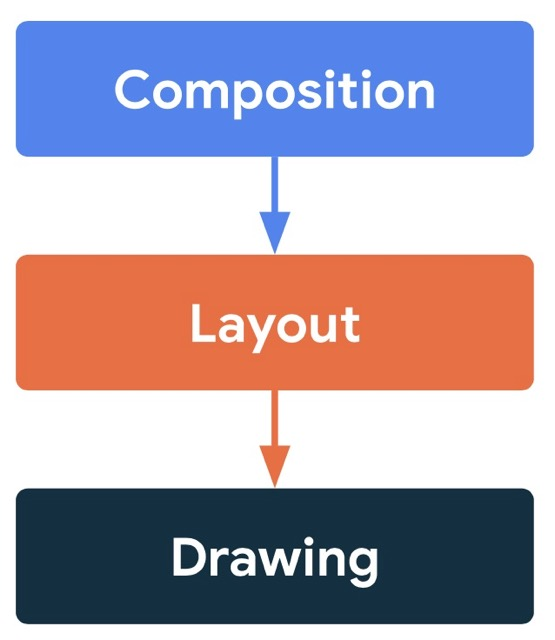

# Zephyr Compose Multiplatform

[](https://central.sonatype.com/artifact/io.github.zheniaregbl/zephyr.core)
[](LICENSE)

Modern UIKit based on Compose Multiplatform.

Zephyr Compose Multiplatform is a library of ready-made user interface components designed to simplify the creation of stylish and responsive applications on Android, iOS and Desktop platforms using Compose Multiplatform.

## 🌟 Features
 - **Performance Optimization**: Using Canvas for most components minimizes redrawing, ensuring smooth interface operation even in complex scenarios.
 - **Ease of use**: Intuitive and easily configurable components that integrate into your project with minimal amount of code.
 - **Cross-platform support**: One code for Android, iOS and Desktop.

## 🛠️ Performance optimization
Zephyr Compose Multiplatform is designed with a priority on maximizing user interface performance, making it an ideal choice for applications requiring high responsiveness and smoothness. The key feature is the use of Canvas to draw most components, which allows you to bypass one of the most resource—intensive stages of the traditional rendering process in Compose Multiplatform — the layout phase.

## ❓Why Canvas
<br> In the standard rendering of the Jetpack Compose interface, the rendering process includes several stages: composition, layout, and drawing. The layout phase, which is responsible for determining the sizes and positions of elements, can be particularly costly when working with a large number of components or complex interfaces, especially on devices with limited resources. Zephyr Compose Multiplatform minimizes this load by using the low-level Canvas API to directly render most UI elements. This allows you to:
 - **Skip the layout phase**: Instead of relying on a standard layout mechanism for each component, the UI Kit draws elements directly, which reduces the amount of calculations and speeds up rendering.
 - **Reduce the number of redraws**: Components implemented through Canvas are optimized to minimize redraws, which is especially important for animations and dynamic interfaces.
 - **Reduce resource consumption**: Direct rendering reduces the load on the CPU and GPU, which improves performance on devices with low computing power and increases energy efficiency.<br clear="right"/>

## Download
Zephyr Compose Multiplatform is available on `mavenCentral()`.

In .toml file
```toml
[versions]
zephyr = "1.0.0-alpha03"

[libraries]
# For core module
zephyr-core = { group = "io.github.zheniaregbl", name = "zephyr.core", version.ref = "zephyr" }
# For foundation module
zephyr-foundation = { group = "io.github.zheniaregbl", name = "zephyr.foundation", version.ref = "zephyr" }
```

In build.gradle.kts
```kotlin
kotlin {
    sourceSets {
        commonMain.dependencies {
            // For core module
            implementation(libs.zephyr.core)
            // For foundation module
            implementation(libs.zephyr.foundation)
        }
    }
}
```
